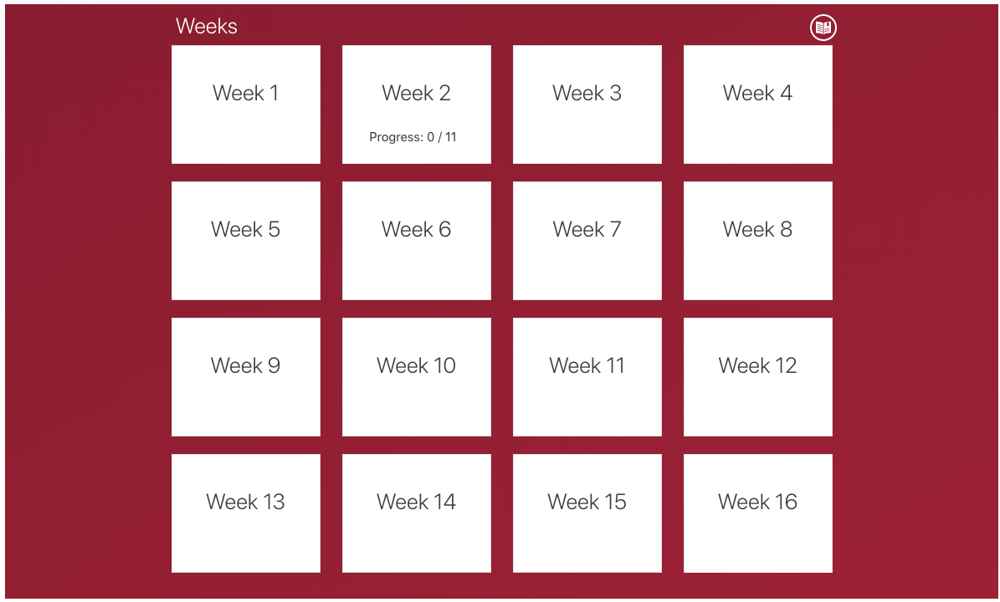
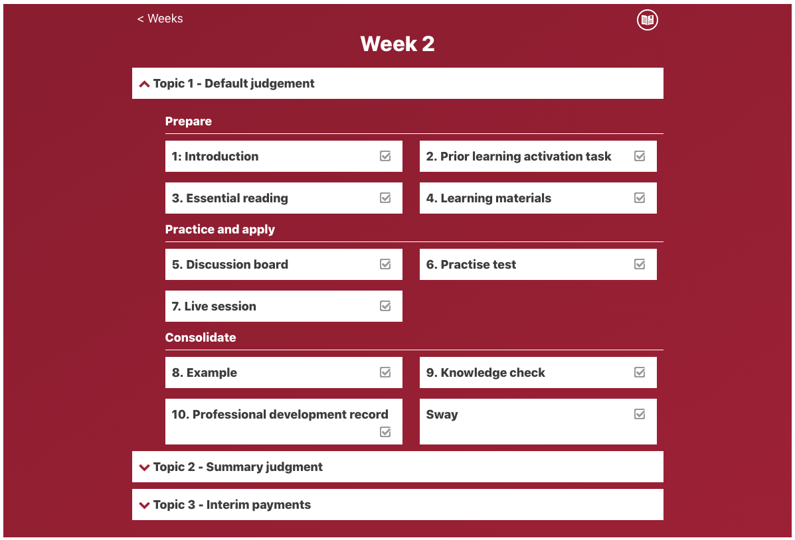
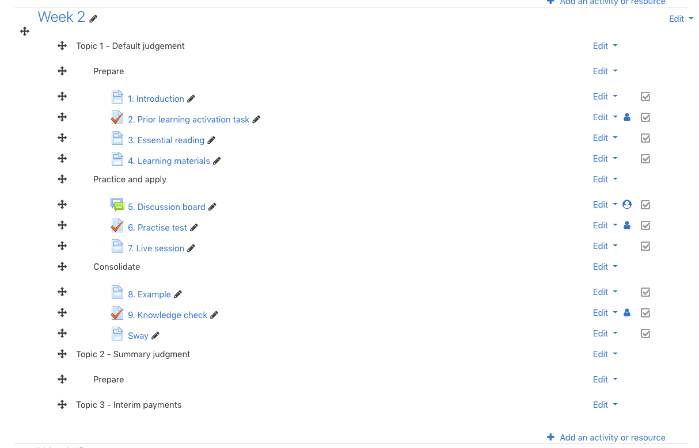

# Pearson Grid course format

This is a standalone course format that renders a course in a particular
fashion. Pearson are advocating a particular course design that is intended to lead a
student through the course material in a structured way. It initially displays a grid of weeks:

Clicking on a week then gives the following display where each week is divided into a series
of topics and each topic can have, for example, 3 divisions (e.g. **Prepare**, **Practice and apply**,
and **Consolidate**):

When editing the course, a standard topics format course edit
layout is used.

## Course design

The Pearson Grid course format requires a specific course structure to
display correctly.

Each section title should be quite short to fit into the course home
page grid layout. The typical title will be "Week n".

Within a section, representing a week of content, use a label with no
indent to give a topic title. Within a topic, a label indented once to
the right is used to split the activities into the prepare, practice
and apply, and consolidate topic divisions. Finally each activity needs to be
indented twice to the right within their relative topic divisions.

The following image illustrates the indentation structure for an example
week:

To add a topic to a week, create a Label and supply the topic title as the
Label text. It also makes sense to ensure that the
Activity completion/Completion tracking setting is set to
*Do not indicate completion*.

To add a topic division, create a Label, supply the topic division title (e.g.
*Practice and apply*), and turn off Completion tracking as above. After Saving
the new Label, use the right hand *Edit* popup menu and select the *Move right*
option to indent the topic division Label one step.

To add an activity to a topic division, create the Activity required, set the
desired Completion tracking option. After saving the Activity and returning
to the course, use the right hand *Edit* popup menu and select the *Move right*
option twice to indent the Activity two steps.

When creating a new Label or Activity, they will appear at the bottom of
the Week section, so they will need to be dragged into the correct location
within the Week.

## Possible rendering issues

If the indentation is not correct then the following rendering issues may
occur:

* If an Activity is not indented at all, the title of the activity will be
treated as a topic, but will not be an active link.
* If an Activity is indented once and is at the top of a week, then nothing
will be displayed (because a topic Label with no indent is expected as the
very first thing in a week).
* Otherwise an Activity indented only once will be considered to be a topic
division title, and again just the text will be displayed with no link.
* If an Activity is indented twice but not underneath a topic division Label
then it will not be displayed at all.
